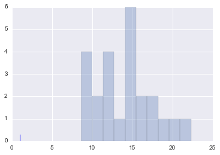
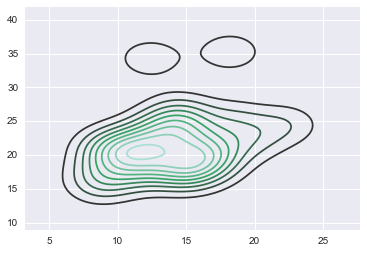
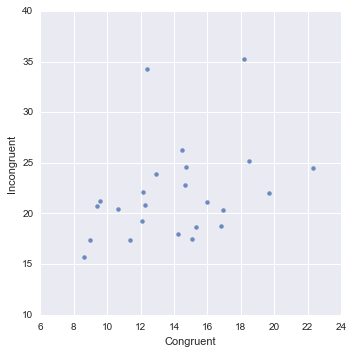

# Project 1
### The Science of Decisions
View the project here: https://docs.google.com/document/d/1Ow6nhTOzt7CVmHbBxsd3Nno_l2L-FLaoeDpQQP8-RVo/edit

### Background Information
In a Stroop task, participants are presented with a list of words, with each word displayed in a color of ink. The participant’s task is to say out loud the color of the ink in which the word is printed. The task has two conditions: a congruent words condition, and an incongruent words condition. In the congruent words condition, the words being displayed are color words whose names match the colors in which they are printed: for example RED, BLUE. In the incongruent words condition, the words displayed are color words whose names do not match the colors in which they are printed: for example PURPLE, ORANGE. In each case, we measure the time it takes to name the ink colors in equally-sized lists. Each participant will go through and record a time from each condition.

### 1. Variables
Our independent variable is whether or not the colors of ink are congruent to the colors implied by the words semantic meaning. The dependent variable is the time elapsed while the subject speaks out all the colors desired for the word set. I conclude the independent variable has two levels: one congruent, the other incongruent.

### 2. Hypotheses and Statistical Tests
I do not know what the appropriate answer is yet.

##### Wrangling our data into a pandas dataframe


```python
#import pandas and read the the csv into a dataframe to work with
import pandas as pd
path = r'~/Google Drive/DAND/P1/stroopdata.csv'
df = pd.read_csv(path)
```


```python
#check your data
df.head()
```


<div>
<table border="1" class="dataframe">
  <thead>
    <tr style="text-align: right;">
      <th></th>
      <th>Congruent</th>
      <th>Incongruent</th>
    </tr>
  </thead>
  <tbody>
    <tr>
      <th>0</th>
      <td>12.079</td>
      <td>19.278</td>
    </tr>
    <tr>
      <th>1</th>
      <td>16.791</td>
      <td>18.741</td>
    </tr>
    <tr>
      <th>2</th>
      <td>9.564</td>
      <td>21.214</td>
    </tr>
    <tr>
      <th>3</th>
      <td>8.630</td>
      <td>15.687</td>
    </tr>
    <tr>
      <th>4</th>
      <td>14.669</td>
      <td>22.803</td>
    </tr>
  </tbody>
</table>
</div>


### 3. Descriptive stats
Two measures of central tendency are the mean and 50%, or median which are (for Congruent) 14.05 and 14.36 [s] respectively.
One measure of variability is the standard deviation which is 3.56 [s] for Congruent.
We could also compare the interquartile range (50%-25%).


```python
#describe our dataframe
df.describe()
```

    test


<div>
<table border="1" class="dataframe">
  <thead>
    <tr style="text-align: right;">
      <th></th>
      <th>Congruent</th>
      <th>Incongruent</th>
    </tr>
  </thead>
  <tbody>
    <tr>
      <th>count</th>
      <td>24.000000</td>
      <td>24.000000</td>
    </tr>
    <tr>
      <th>mean</th>
      <td>14.051125</td>
      <td>22.015917</td>
    </tr>
    <tr>
      <th>std</th>
      <td>3.559358</td>
      <td>4.797057</td>
    </tr>
    <tr>
      <th>min</th>
      <td>8.630000</td>
      <td>15.687000</td>
    </tr>
    <tr>
      <th>25%</th>
      <td>11.895250</td>
      <td>18.716750</td>
    </tr>
    <tr>
      <th>50%</th>
      <td>14.356500</td>
      <td>21.017500</td>
    </tr>
    <tr>
      <th>75%</th>
      <td>16.200750</td>
      <td>24.051500</td>
    </tr>
    <tr>
      <th>max</th>
      <td>22.328000</td>
      <td>35.255000</td>
    </tr>
  </tbody>
</table>
</div>


### 4. Visualizations
I'm going to try to use matplotlib and seaborn.


```python
# set up
%matplotlib inline
import seaborn as sns
import matplotlib.pyplot as plt
import random
```


```python
#not sure what's going wrong here; dimensional analysis on my data?
'''
I got to the code shown; i haven't labeled it and am not sure what the error was. 
I added .any() to the input the sns.rugplot()
"the truth value of an array..use .any() or .all()"
'''

plt.hist(df.Congruent,alpha=.3);
sns.rugplot(df.any());
```





```python
# density plot
sns.kdeplot(df)
```


    <matplotlib.axes._subplots.AxesSubplot at 0x1103cd550>





```python
sns.lmplot('Congruent','Incongruent', data=df, fit_reg=False)
```


    <seaborn.axisgrid.FacetGrid at 0x1107d65d0>





### 5. Statistical Tests

##### Results


```python
# under constrution
```

##### Confidence Level and Critical Statistical Value


```python
# under construction
```

##### Conclusions


```python
# under construction
```

### 6. Continued Thoughts


```python
# under construction
```


```python

```
